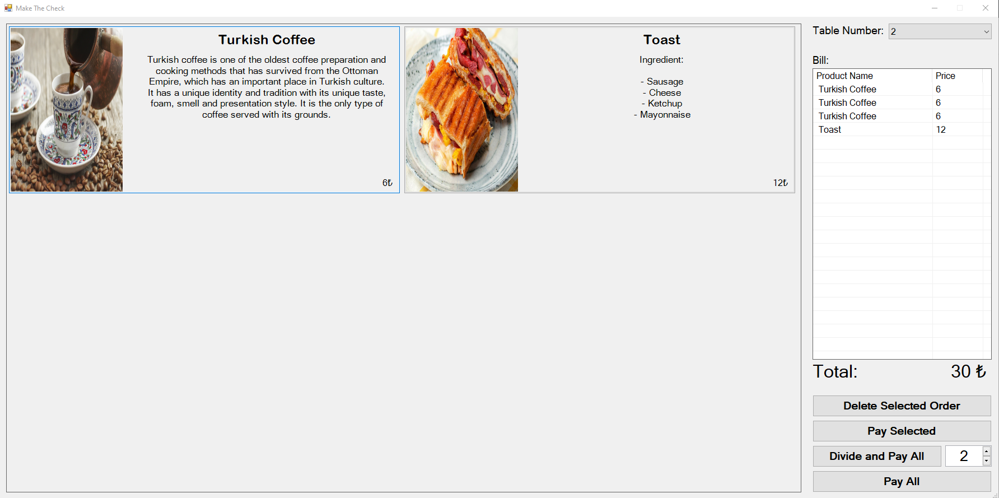
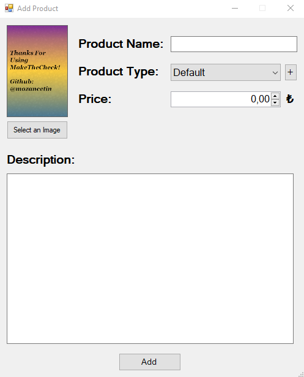

# MakeTheCheck
Cafe automation program written in C#

# Images
<h3>Add Order to Tables</h2>

 From the section below, you can add orders to your tables, delete these orders or pay for the orders. 

 
<h3>Product Adding Section</h3>

 This section is the product addition section of the program. As you can see, in this section, we can choose a photo for the product, specify the name and description of the product, specify what type of product it is (for example, breakfast) and determine the price of our product. 

  

 You can also save and delete table numbers in the program. Orders are given according to the table number. 

# TODO's
- [ ] Add icons
- [ ] Make a Z Report (Report of the day)
- [ ] Add waiter
- [ ] Make some design
- [ ] Make stock calculation
